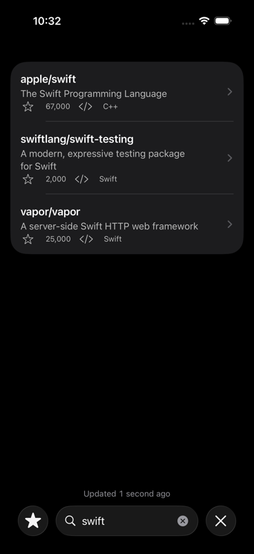
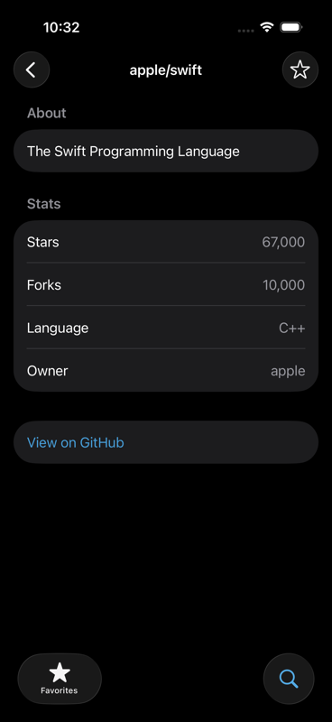
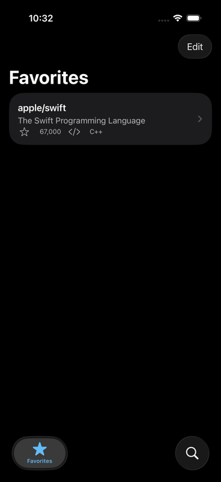
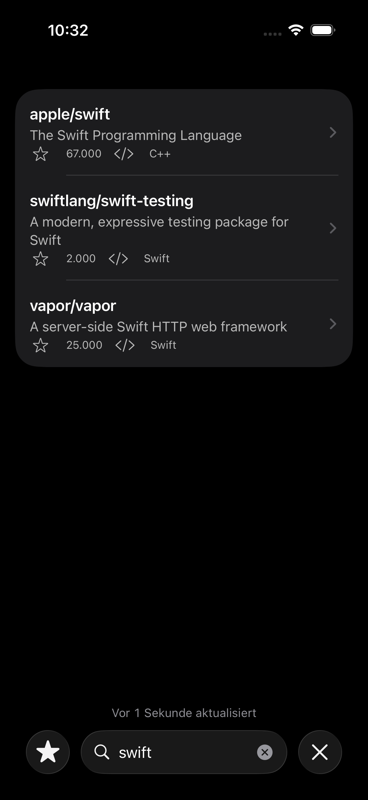

# RepoScout

| Search | Detail |
| --- | --- |
|  |  |

| Favorites | Search (German) |
| --- | --- |
|  |  |

Those four images are taken **by the test suite**, from the same hermetic
launch every UI test uses, so they cannot drift from the app without a run
saying so. `ScreenshotGalleryUITests` attaches them; regenerate them from
`testExample/` with:

```bash
xcodebuild test -project testExample.xcodeproj -scheme testExample \
  -destination 'platform=iOS Simulator,name=iPhone 17 Pro' \
  -resultBundlePath /tmp/screenshots.xcresult \
  -only-testing:testExampleUITests/ScreenshotGalleryUITests
xcrun xcresulttool export attachments \
  --path /tmp/screenshots.xcresult --output-path /tmp/shots
```

`/tmp/shots/manifest.json` maps each exported file to the attachment name it
was given (`01-search-results` and so on); copy them to `docs/screenshots/`
under those names and shrink them with
`/usr/bin/sips -Z 800 docs/screenshots/*.png`.

RepoScout is a small, complete reference app for practicing 2026-era iOS
development. It searches GitHub's public repository index and lets you save
results as favorites, and it exists to be *read* as much as to be run: every
file is written to demonstrate one current Apple-platform practice cleanly,
with the surrounding tests as proof that the practice actually works. If
you're relearning iOS after a few years away, or just want a compact example
of how a modern SwiftUI app is put together end to end — networking, state
management, persistence, and testing — this is meant to be a useful map.

The app itself is intentionally modest. A Search tab lets you type a query
into a `searchable` field and see live results from GitHub's
`/search/repositories` API, with debounced input so it doesn't fire a
request per keystroke. Tapping a result opens a detail screen showing stars,
forks, language, and a link back to GitHub, plus a button to favorite it. A
Favorites tab lists everything you've favorited, backed by on-device
persistence, so it survives relaunches and updates live as favorites change
anywhere else in the app.

## Requirements

Building and running RepoScout requires **Xcode 26.2 or later**. The project
targets Swift 6 language mode with the compiler's default actor isolation
set to `MainActor` and approachable concurrency enabled. Both are **target**
build settings, not something you need to configure yourself, but they're why
the codebase reads the way it does (see `ARCHITECTURE.md` for what that means
in practice). Note which targets: approachable concurrency is on for all
three, while default-`MainActor` isolation is set on the **app target only**.
That is deliberate — the unit suite is deliberately *not* main-actor by
default, which is why suites that touch `SearchViewModel` carry an explicit
`@MainActor` and say so in a comment.

## Running the app

Open `testExample/testExample.xcodeproj` in Xcode and run the `testExample`
scheme on a simulator or device. (The project and its scheme are still named
`testExample` — see the note at the bottom of this file for why — but the
app that launches is RepoScout, with that name and icon.) No API key or
configuration is required: GitHub's search endpoint is public and the app
calls it directly over `URLSession`.

The app is iPhone-only and English/German. Both are deliberate, and they are
argued in two different places: iPhone-only under "Shipping hygiene" in
`ARCHITECTURE.md`, the two languages under "Accessibility and localization"
in the same file.

## Running the tests

RepoScout has two independent test suites: a Swift Testing unit suite that
covers decoding, the search view model's state machine and cancellation
behaviour, the live network client's URL construction and HTTP-status-to-error
mapping, the SwiftData favorites store, and — in `RepoRowLabelTests` — the
localized VoiceOver sentences a row speaks, in both languages; and an
XCTest-based UI suite that drives the real app through its screens against a
mocked network so it stays hermetic and offline, including an accessibility
audit at default and accessibility text sizes.

The scheme is shared — it lives at
`testExample/testExample.xcodeproj/xcshareddata/xcschemes/testExample.xcscheme`
— so every command below works on a fresh clone: no "scheme not found", and
nothing to configure in Xcode first.

**Run every command in this section from `testExample/`**, the directory that
holds `testExample.xcodeproj`. They are written without a leading `cd` so they
can be copied singly.

**Every command below runs the suite twice.** The scheme's test action points
at a shared test plan, `testExample/testExample.xctestplan`, which declares two
configurations: English (`en`/`US`) and German (`de`/`DE`). So a plain
`xcodebuild test` runs both languages, and the German pass is the app's
localization check rather than something a maintainer has to remember. Budget
roughly twice the wall-clock time you would expect: a full run lands around
twelve minutes, nearly all of it the UI suite, and the unit suite on its own
is a couple of minutes. (The guide's §2 and `ci.yml`'s timeout comment quote
the same hedged figure; if one moves, move all three.)

Some UI tests skip themselves under German, report the reason, and are
expected rather than a failure. Six match strings **Apple** owns and
translates — `ContentUnavailableView.search(text:)`'s "No Results" title,
`EditButton`'s "Edit" and the "Delete" confirmation it leads to, and
`UISearchTextField`'s "Clear text" button, which the four accessibility audits
share — and two are the screenshot gallery above, which is produced once, in
the development language. Eight, then, from two unrelated causes — and that is
the same count the test report shows. If it ever differs, the report is right
and this sentence is stale.

Run everything — unit and UI:

```bash
xcodebuild test -project testExample.xcodeproj -scheme testExample -destination 'platform=iOS Simulator,name=iPhone 17 Pro'
```

Run just the unit tests:

```bash
xcodebuild test -project testExample.xcodeproj -scheme testExample -destination 'platform=iOS Simulator,name=iPhone 17 Pro' -only-testing:testExampleTests
```

Run just the UI tests:

```bash
xcodebuild test -project testExample.xcodeproj -scheme testExample -destination 'platform=iOS Simulator,name=iPhone 17 Pro' -only-testing:testExampleUITests
```

The plan also turns code coverage on, scoped to the app target so the number
describes the code under test rather than being inflated by the test bundles'
coverage of themselves. It also enables per-test timeouts with a 120-second
default allowance, so a hung UI test fails with a message instead of consuming
the whole run. Ask for a result bundle and read the coverage back:

```bash
xcodebuild test -project testExample.xcodeproj -scheme testExample \
  -destination 'platform=iOS Simulator,name=iPhone 17 Pro' \
  -resultBundlePath /tmp/RepoScout.xcresult
xcrun xccov view --report --only-targets /tmp/RepoScout.xcresult
```

Replace `iPhone 17 Pro` with any simulator you actually have installed
(`xcrun simctl list devices available` will tell you), or — if you only want
to check that the project compiles — use
`-destination 'generic/platform=iOS Simulator'` with `xcodebuild build`,
which needs no booted device at all.

You can equally well run either suite from Xcode's Test navigator (`Cmd-U`
runs both by default; select a specific suite to scope it). The configuration
picker in the test plan editor is where you can run just one language.

There is a GitHub Actions workflow at `.github/workflows/ci.yml` with three
jobs on a macOS 26 runner: the unit suite, the UI suite (which writes a result
bundle and uploads it as an artifact even when the run passes, because a UI
failure on a runner is otherwise a log line with the screenshots left behind
on a machine that no longer exists), and an advisory formatter pass. Nothing
has ever executed it — this repository has no remote — but the two test
commands are the ones above, committed so the first push to a remote inherits
them.

A `.swift-format` at the repository root records the house style (four-space
indentation, 120 columns) for `swift-format`, which ships with the toolchain.
It is a record, not a gate, and the honest reason is visible in what it
reports.

**This one command runs from the repository root**, not from `testExample/`
like the rest of this section — `testExample` is the path it lints, and it is
the same line `.github/workflows/ci.yml` runs:

```bash
xcrun swift-format lint --recursive testExample
```

It reports **265 diagnostics across twelve files: 177 `Indentation`, 77
`AddLines`, 9 `LineLength`, 2 `Spacing`.** The first two categories — 254 of
the 265 — are the pretty-printer's opinions about where to break multi-line
call arguments and how to lay out multi-line collection literals, which this
codebase disagrees with on purpose: reflowing readable fixtures and `#expect`s
into the formatter's shape serves no reader. Note that those two categories
*grow* when a long line is broken by hand, because a wrapped call is exactly
what the pretty-printer then has an opinion about — which is why the count
went up, not down, in the round that removed four `LineLength` warnings.

The nine long lines are the interesting ones, and every one of them is a
`String(localized:comment:)` translator comment. That argument is a
`StaticString`, so the line cannot be shortened without either putting a
newline into the comment a translator reads or telling them less — neither of
which is a trade worth making for a column count. There is no residue here:
long lines that *could* be broken have been, which is why nine is both the
count and the whole explanation.

CI runs this exact command with `|| true` and surfaces the output. There is no
`--strict`, because that flag's only effect is a non-zero exit status that
`|| true` would immediately discard.

## What to look at

Each of these files or directories is the clearest example of the practice
next to it. If you're skimming rather than reading front to back, this is
the fastest path to the interesting parts.

| Practice | Where |
| --- | --- |
| `LoadState` — a closed enum instead of boolean soup for async state | `testExample/testExample/Support/LoadState.swift` |
| Combine debounce over a keystroke stream | `testExample/testExample/ViewModels/SearchViewModel.swift` |
| Protocol-based dependency injection | `testExample/testExample/Services/GitHubClient.swift`, `testExample/testExample/Support/AppDependencies.swift` |
| SwiftData persistence (model, reads via `@Query`, writes via a store) | `testExample/testExample/Persistence/` |
| Swift Testing (the modern `#expect`/`@Test` unit-test framework) | `testExample/testExampleTests/` |
| BDD-style UI tests (Given/When/Then over XCUITest) | `testExample/testExampleUITests/` |
| Localization (String Catalog, commented keys, plural *substitutions* inside whole-sentence accessibility labels, full German) | `testExample/testExample/Views/Search/RepoRowView.swift`, `testExample/testExample/Localizable.xcstrings` |
| A test plan with two language configurations, and coverage scoped to the app | `testExample/testExample.xctestplan` |
| Accessibility (merged row elements, Dynamic Type via `ViewThatFits`, a VoiceOver-safe ticker) | `testExample/testExample/Views/Search/RepoRowView.swift`, `testExample/testExample/Views/Search/SearchView.swift` |
| README screenshots generated by the UI suite, not taken by hand | `testExample/testExampleUITests/ScreenshotGalleryUITests.swift` |

`ARCHITECTURE.md` walks through how these pieces connect, with a reading
path for whatever your starting point is.

`RepoScout-Guide.pdf`, at the repository root, is a rendered field guide to
this codebase — the same ground as the two documents above, laid out for
reading away from an editor. Its editable source lives at
`docs/guide/reposcout-guide.html`, with the render command in its header;
edit there, re-render, and commit both.

## A note on the project name

The Xcode project, its schemes, and its targets are still named
`testExample` — that's deliberate, not an oversight. The project was
scaffolded under that name before RepoScout was designed, and renaming an
Xcode project after the fact touches a lot of fragile, auto-generated
`project.pbxproj` machinery for zero functional benefit. Rather than risk
that churn, the product identity (display name, app icon, and everything a
user or reader actually sees) was layered on as RepoScout while the
underlying project scaffolding kept its original name. `RepoScoutApp.swift`
is the `@main` entry point; `testExample.xcodeproj` is just the file you
double-click to get there. The one place the scaffold name genuinely
mattered — the bundle identifier, which is what a device actually records —
*was* changed: the app ships as `work.timmaher.RepoScout`.

## License

MIT — see [`LICENSE`](LICENSE). Copy anything here into your own project.
